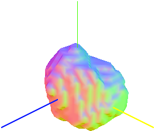
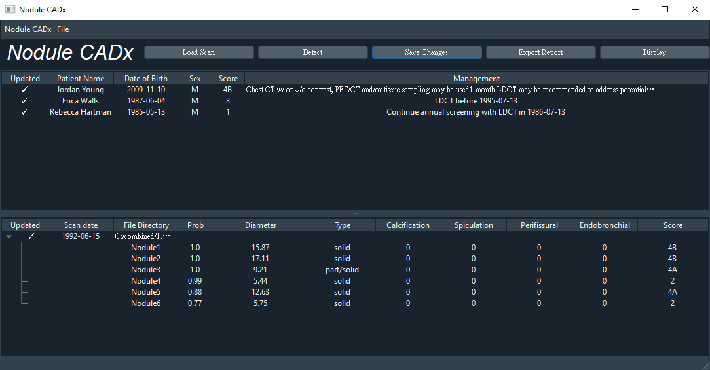
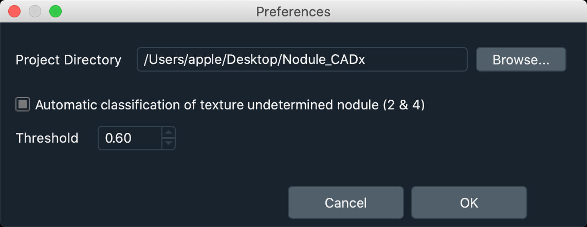

<p align="center">
  <a href=#>
    
  </a>
  <h2 align="center">Nodule CADx</h2>
    <div align="center">
     Pulmonary nodules computer-aided diagnosis demo system.
  </div>
   	<div align="center">
     Basically an application integrate <a href="https://github.com/uci-cbcl/NoduleNet">NoduleNet</a> & texture classification model.
</div>
<!--<br>
    <div align="center" 
    style="padding: 15px;
			 margin-bottom: 20px;
			 border: 1px solid transparent;
			 border-radius: 4px;
			 background-color: #fcf8e3;
			 border-color: #faebcc;
			 color: #8a6d3b;">
			 <strong>Warning!</strong> Performance of the system is still incomplete and far away from practical use.
</div>
-->
</p>

> :warning: **Warning**: Performance of the system is still incomplete and far away from practical use.

## Table of contents
* [Application Demo](#application-demo)
* [Introduction](#introduction)
* [Models](#models)
* [Built With](#built-with)
* [Getting Started](#getting-started)
* [Future Work](#future-work)
* [Acknowledgments](#acknowledgments)

## Application Demo
### [Nodule CADx – Demo (YouTube)](https://www.youtube.com/watch?v=YGXbBjzzQKI)
<p align="center">
<a href=>
    <imjlhlkg src="resources/dedmo.gif" alt="demo" width="720" height="450">
</a>
</p>

## Introduction
This is a pulmonary nodules (lung nodules) computer-aided diagnosis (CADx) demo application, which cound directly raise a diagnostic suggestion based on Lung-RADS automatically from computed tomography (CT) scan.

The application has three different view:

* Main Window
* Screening Window
* Preferences

### Main Window

<p align="center">
    
</p>

* Have a quick view of patient list and corresponding scans & nodules information.
* Field introduction
	* Upper block: Patient list
		* `Updated`: Indicate if all the scans of this patient have been detected
		* `Patient Name`/`Date of Birth`/`Sex` : Information of patient
		* `Score`/`Management`: Output based on Lung-RADS
	* Lower block: Scan & Nodule list
		* `Updated`: Indicate if the scan has been detected
		* `Scan date`/`File Directory`: Information of scan
		* `Type`: Texture type of corresponding nodule, has five categories (Non-Solid, Non/Part, Part-Solid, Part/Solid, Solid)
		* `Calcification`/`Spiculation`/`Perifissural`/`Endobronchial`: 0 indicate No and 1 indicate Yes
		* `Score`: Score of single nodule based on Lung-RADS
* Button introduction
	* `Load Scan`: Load CT scan
	* `Detect`: Run automatic diagnosis on seleteced scan, it may take minutes
	* `Save Changes`: Since the information of nodules could be edited by user, save those changes to project file (.json)
	* `Export Report`: Export field information in csv format
	* `Display`: Open screening window for selected scan


### Screening Window

<p align="center">
    
</p>

* Showing selected scan and it's corresponding detected nodules
* Since model isn't perfect, user can edit nodules information here


### Preferences
* Several simple settings of application
* LIDC-IDRI dataset label texture in 5 categories (1~5), with 2 & 4 is undetermined. Check the box will classify 2 with 1, and 4 with 5
* Threshold indicate thresholding the probability at detection stage

<p align="center">
    
</p>


## Models

There are two models in [models](linkkkkkkkk)

* nodulenet_model.ckpt
	* Perform nodule detection & segmentation
	* Follow the training procedure describe at [NoduleNet repo](https://github.com/uci-cbcl/NoduleNet)
	* Since I modified some `data_parallel` code in [net]() to make model run on CPU, replace the [net]() directory for your own use may be needed
* classification_model.pkl
	* Perform nodule texture classification (only for Non-Solid, Part-Solid and Solid classification)
	* Train with LIDC-IDRI dataset (LUNA16 1186 nodules selected version)
	* Using `Radiomics` methodology, with `Principal Component Analysis (PCA)` and `Support Vector Regression (SVR)`


## Built With
Modules besides python built-ins

 * GUI - [PyQt5](https://pypi.org/project/PyQt5/) / [QDarkStyle](https://pypi.org/project/QDarkStyle/) / [PyQtGraph](https://pypi.org/project/pyqtgraph/)
 * Basic - [NumPy](https://pypi.org/project/numpy/) / [SimpleITK](https://pypi.org/project/SimpleITK/) / [OpenCV](https://pypi.org/project/opencv-python/) / [Scikit-Image](https://pypi.org/project/scikit-image/) / [SciPy](https://pypi.org/project/scipy/)
 * Model Relatives - [PyTorch](https://pytorch.org/) / [Scikit-Learn](https://scikit-learn.org/stable/) / [PyRadiomics](https://pyradiomics.readthedocs.io/en/latest/)
 * Others - [Faker](https://faker.readthedocs.io/en/master/) / [dateutil](https://dateutil.readthedocs.io/en/stable/)
 
## Getting Started
### Prerequisites
* Ensure you could run a [NoduleNet]() model on your device
* Replace [net]() directory or [config.py]() or [nodulenet_model.ckpt]() may be needed

### Installation
* Clone the repo

```sh
git clone https://github.com/wenyalintw/Nodule_CADx.git
```

* ***TODO*** Install required modules listed in [requirements.txt](https://github.com/wenyalintw/Google-Patents-Scraper/blob/master/requirements.txt) 

```sh
pip install -r /path/to/requirements.txt
```

* Ready to go

```sh
cd src
python main.py
```


## Future Work
* Lung ROI segmentation
* Size based on Lung-RADS criteria
* Types classification beside texture

## Acknowledgments
- [NoduleNet repo](https://github.com/uci-cbcl/NoduleNet)
- Reference of screening window apperance design: [ITK-SNAP](http://www.itksnap.org/pmwiki/pmwiki.php)
- [trashcan.png](https://github.com/wenyalintw/Nodule_CADx/blob/master/src/resources/trashcan.png) licensed under "CC BY-ND 3.0" downloaded from [ICONSDB](https://www.iconsdb.com/white-icons/trash-2-icon.html)

###### MIT License (2020), Wen-Ya Lin